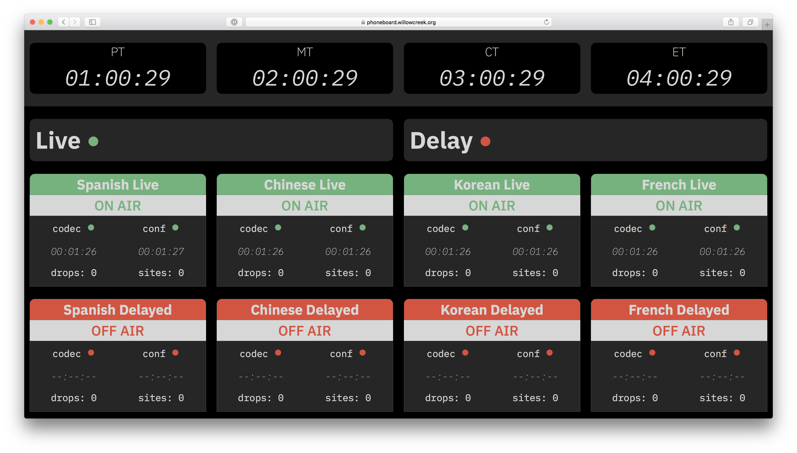
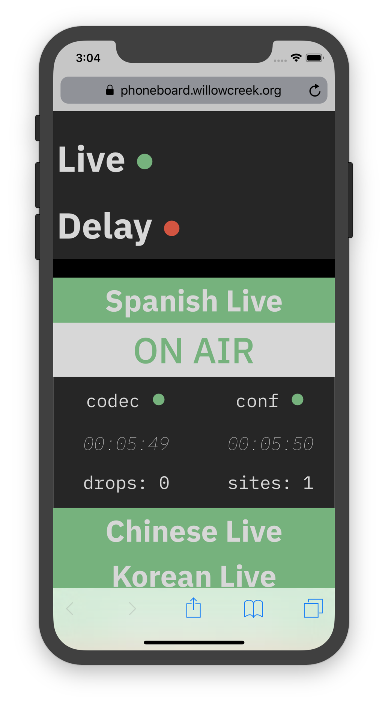
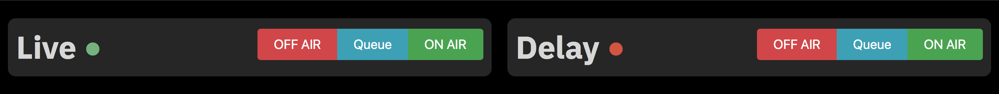
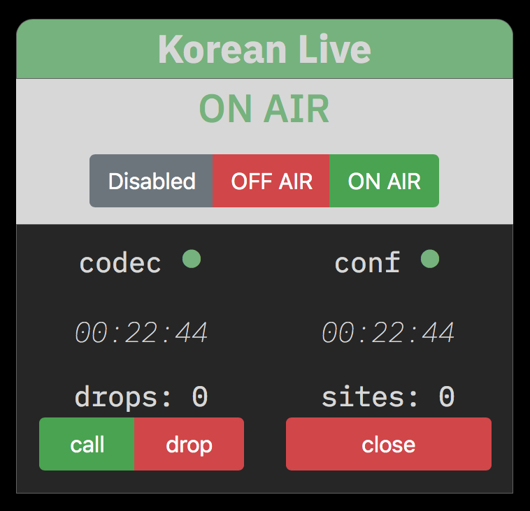

# Phoneboard
Phoneboard manages Twilio hosted conference calls and JK Audio AutoHybrid IP2 devices.


## Screenshots
|                    Desktop                     |                  Mobile                  |
|:----------------------------------------------:|:----------------------------------------:|
|  |  |


## Controlling Phoneboard


<kbd>l</kbd> brings up the main controls for phoneboard.  Groups of codecs and calls can be controlled with OFF-AIR, Queue, and ON-AIR.


### Manual Controls
There are additional manual controls for phoneboard.  These are availible for testing individual codec and Twilio API functions.

<!--  -->
<p align="center">
  
</p>

Access additional controls by pressing <kbd>e</kbd>.
##### Watchdog Controls
* **Disabled** - Disables the watchdog for that channel. The * codec is left in its current state.
* **OFF AIR** - Ends the Twilio conference via the Twilio API and drops the call on the codec.
* **ON AIR** - Dials the codec and redials once a call is dropped.

##### Codec Controls
* **call** - Set codec to dial.
* **drop** - set codec to drop call.

##### Twilio Controls
* **close** - Close conference via Twilio API.

## Keyboard Shortcuts
* <kbd>esc</kbd> - Reload
* <kbd>1</kbd>...<kbd>8</kbd> - Monitor conference channel
* <kbd>c</kbd> - Toggle clocks
* <kbd>e</kbd> - Toggle manual controls
* <kbd>f</kbd> - Toggle fullscreen
* <kbd>l</kbd> - Toggle mastercontrol

## Installation
Download phoneboard from github
```
git clone https://github.com/karlcswanson/phoneboard.git
cd phoneboard/
```

Install dependencies via npm & pip
```
npm install
pip3 install -r py/requirements.txt
```

build and run phoneboard
```
npm run build
npm run server
```
